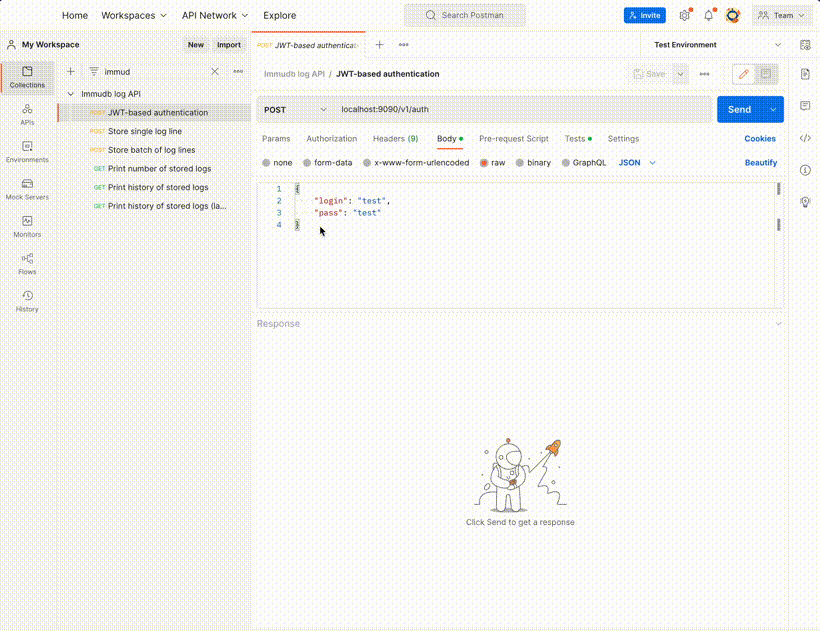

# ImmuDB log API

## Task description

The goal is to write a simple REST or GRPC service in Golang that uses immudb as a database to store lines of logs. Service and immudb should be easily deployable using docker, docker-compose or similar.
There should be another simple testing tool that allows you to easily create log entries.

The service should allow to:
- Store single log line
- Store batch of log lines
- Print history of stored logs (all, last x)
- Print number of stored logs
- (optional) Simple authentication mechanism to restrict read/write access.
- (optional) Support for log buckets, so logs from different applications can be separated i.e. depending on source or some token used.

## Solution notes

- :trident: clean architecture (handler->service->repository)
- :book: standard Go project layout (well, more or less :blush:)
- :arrows_counterclockwise: gRPC + gateway for REST API
- :whale: dockerized + docker-composed

## HOWTO

- Run in docker-compose with `make dc`. This will start `logapi` and `immudb` containers, create `users` and `loglines` tables and a test user `test` with password `test`.
  
- Run Postman collection from `./postman` to test the API.
  

## TODO
- unit tests
- testing tool

## A picture is worth a thousand words

